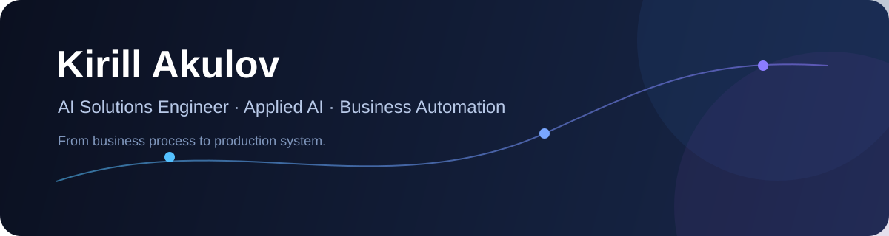

  

  <strong>AI Solutions Engineer · Applied AI · Business Automation</strong> 
  Проектирую AI-системы, интеграции и автоматизацию реальных бизнес-процессов.

  <a href="./README.en.md">English</a> ·
  <a href="./docs/PROJECTS.md">Проекты</a> ·
  <a href="./docs/CAREER.md">Профессиональная траектория</a>

---

## Профиль

Я — **Кирилл Акулов**. Мой фокус — не «писать код ради кода», а превращать реальную бизнес-задачу в работающую цифровую систему: понять процесс, найти узкое место, спроектировать архитектуру, подключить AI и внешние системы, организовать реализацию и проверить результат.

До перехода в IT работал **главным геодезистом**. Инженерный бэкграунд дал мне привычку работать с ограничениями, точностью, ответственностью за результат и реальными производственными процессами. В 2026 году сменил профессиональное направление и сосредоточился на **Applied AI и автоматизации бизнеса**.

Сейчас развиваюсь по траектории:

**AI Solutions Engineer → AI Solutions Architect**

## Чем занимаюсь

- анализирую процессы **AS-IS → TO-BE** и проектирую автоматизацию;
- создаю backend-сервисы и интеграции между CRM, внутренними системами и AI;
- внедряю LLM-классификацию и автоматическую маршрутизацию;
- проектирую идемпотентную обработку webhook/event-driven сценариев, retry и fault handling;
- использую AI-агентов как часть инженерного процесса: постановка задачи → реализация → тесты → review → evidence;
- строю продукты, где важны не только технологии, но и UX, эксплуатация и экономика решения.

## Избранные проекты

### ✈️ [FlyPingAvia](https://github.com/kirillq2098/FlyPingAvia)

**Продукт для мониторинга цен на авиабилеты.** Пользователь задаёт маршрут и желаемую цену, а система отслеживает предложения и уведомляет при достижении порога.

`Python` · `FastAPI` · `aiogram` · `SQLAlchemy` · `APScheduler` · `Telegram Mini App` · `Travelpayouts` · `Docker`

Что уже есть в проекте: Telegram-бот и Mini App, signed Telegram auth, фоновые проверки, price alerts, attribution/deep links, affiliate-модель, health monitoring, production-ready конфигурация и подробная продуктовая/техническая документация.

### 🧠 Service Automation & LeadRouter

**Внутренняя система автоматизации обработки лидов и сервисных заявок производственной компании.**

`Python` · `FastAPI` · `PostgreSQL` · `SQLAlchemy async` · `Alembic` · `Bitrix24 REST` · `LLM` · `Docker` · `GitHub Actions`

Ключевые инженерные задачи: нормализация событий, DB-backed idempotency, безопасная повторная обработка, retry policy, маршрутизация лидов, LLM-классификация, интеграция с Bitrix24, аудит и разделение подтверждённого production-state от просто реализованного кода.

> В текущем репозитории проекта: **531 тест основного сервиса + 590 тестов LeadRouter**. Коммерческий код и внутренние данные не публикуются.

### 🏗️ TopStyle Control

**Внутренняя система управления и планирования строительных/производственных проектов.** Задача — превратить разрозненное ручное планирование в единый контур управления объектами, сроками, зависимостями, прогрессом и рисками.

`FastAPI` · `Next.js` · `PostgreSQL` · `Alembic` · `Docker Compose` · `RBAC`

Проект развивается как отдельная управленческая система, которая должна дополнять существующие CRM/ERP-инструменты, а не имитировать или заменять их без необходимости.

[Подробнее о проектах →](./docs/PROJECTS.md)

## Инженерный стек

| Область | Технологии и практики |
|---|---|
| **Backend** | Python, FastAPI, async applications, REST API, webhooks |
| **Data** | PostgreSQL, SQLAlchemy 2, Alembic, SQLite |
| **Integrations** | Bitrix24 REST, Telegram, external APIs, event-driven flows |
| **Applied AI** | LLM integration, structured classification, routing, AI-assisted engineering |
| **Reliability** | idempotency, transactions, retries, validation, logging, health/readiness |
| **Delivery** | Git, GitHub, GitHub Actions, Docker, Docker Compose, Windows/Linux operations |
| **Product & Process** | requirements discovery, AS-IS/TO-BE, UX logic, roadmap, metrics, technical documentation |

## Как я работаю с AI

Я не считаю ручной набор кода самоцелью. Cursor, Codex и ChatGPT использую как инженерные инструменты для реализации, анализа и тестирования.

Моя зона ответственности — **правильная постановка задачи, архитектура, ограничения, проверяемые критерии, тестирование, разбор ошибок и конечный результат**.

Принцип простой:

> **AI может написать код. Ответственность за систему остаётся у инженера.**

## Что для меня важно в решениях

**Удобство для пользователя → измеримый эффект для бизнеса → надёжность → масштабируемость.**

Я предпочитаю решение, которое сотрудники реально будут использовать, более технологически впечатляющему решению, которое останется демонстрацией.

## Сейчас углубляю

`System Design` · `Solution Architecture` · `Applied LLM Engineering` · `Observability` · `Distributed Systems` · `AI Evaluation`

## Статус портфолио

Это **living portfolio**. Репозиторий обновляется по мере появления подтверждённых результатов, новых проектов и новых инженерных компетенций.

Источником структурированных данных служит [`data/profile.json`](./data/profile.json), а правила обновления описаны в [`docs/UPDATE_POLICY.md`](./docs/UPDATE_POLICY.md).

---

  Novosibirsk · Open to AI / automation / solution engineering opportunities

