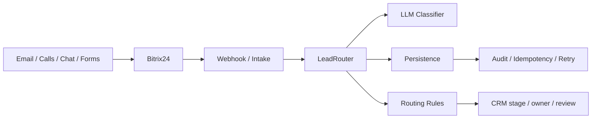
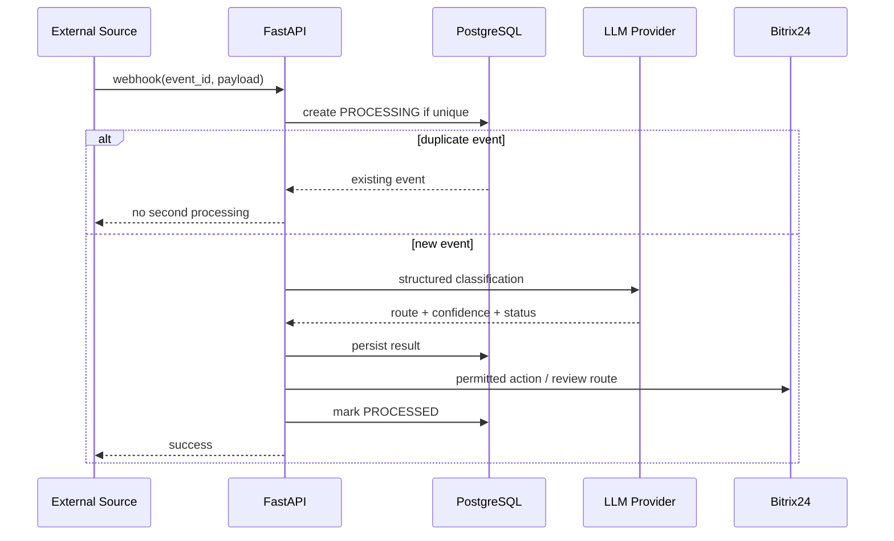
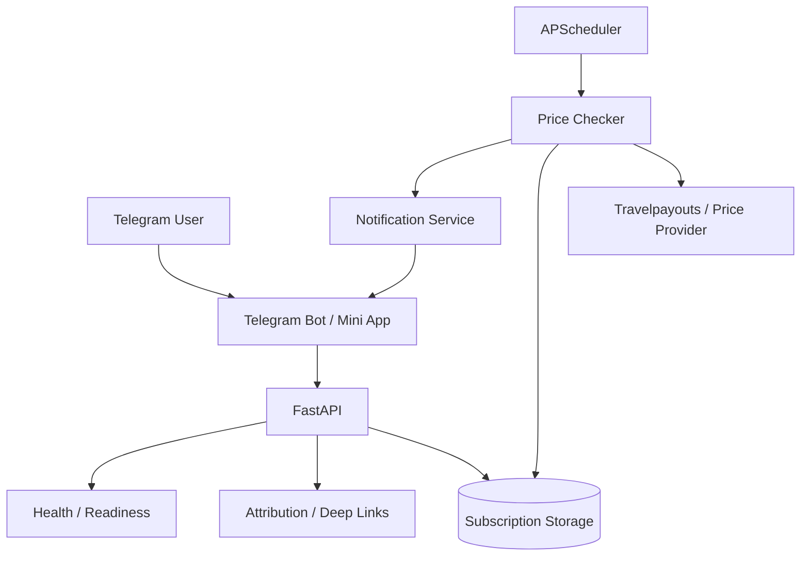
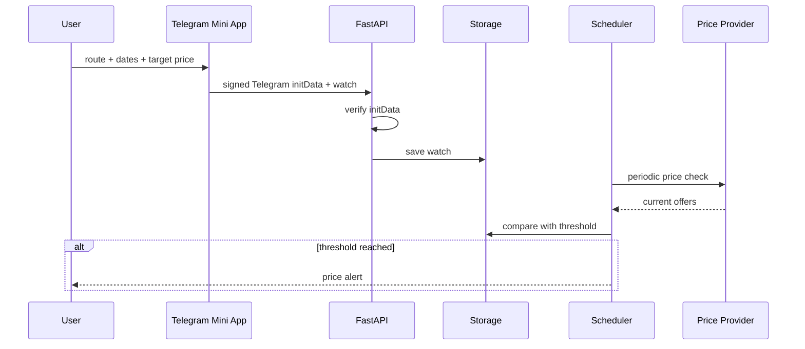
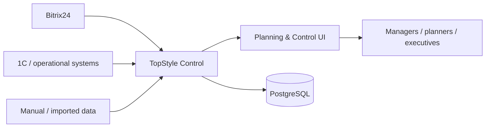
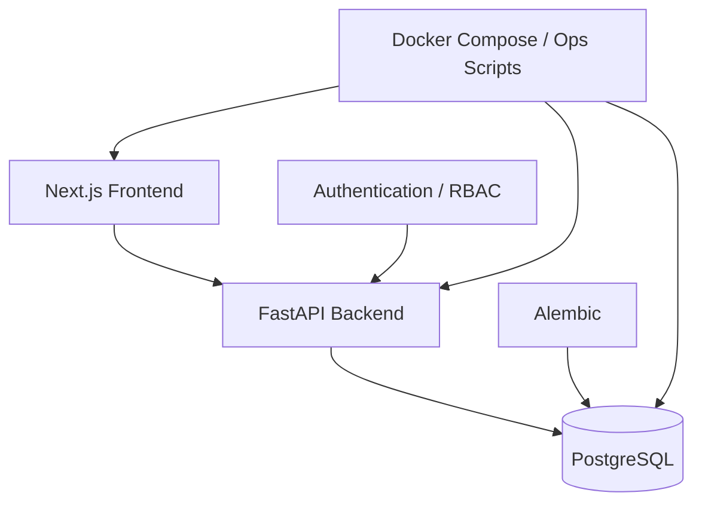

# Architecture Evidence

Этот раздел показывает не только технологии, но и **как я раскладываю систему на компоненты, потоки и границы ответственности**.

## 1. Service Automation & LeadRouter

### Context

### Processing sequence

### Architectural concerns

- idempotency before side effects;
- explicit transactional boundaries;
- retryable failures separated from business failures;
- read/write permissions constrained at integration layer;
- AI response treated as untrusted structured input;
- observable state instead of invisible automation.

---

## 2. FlyPingAvia

### Container view

### Primary user flow

### Architectural concerns

- authentication boundary at Telegram initData;
- user interaction separated from scheduled work;
- provider failures must not corrupt watches;
- development tunnel and production URL are explicitly separated;
- health/recovery considered part of the product, not an afterthought.

---

## 3. TopStyle Control

### Position in enterprise landscape

**Design principle:** TopStyle Control is intended as a management and planning layer. It should integrate with existing systems rather than duplicate every function of CRM or ERP.

### Application containers

## Architecture principles I use

1. **Business boundary before framework.** First define what the system owns and what it should not own.
2. **Idempotency before retries.** Retrying unsafe side effects without idempotency creates duplicate business operations.
3. **State is explicit.** Important automation states must be inspectable and auditable.
4. **AI is a component, not the architecture.** LLM use should be bounded by contracts, validation, fallback and evaluation.
5. **Implementation ≠ production.** Repository evidence, tests and runtime evidence are separate evidence classes.
6. **Prefer the simplest architecture that preserves reliability and future evolution.** Microservices are not a default goal.

## Next architecture evidence to add

- C4 Context / Container diagrams generated from confirmed project state;
- ADR examples for important design decisions;
- threat model for public-facing AI services;
- observability model: logs, metrics, traces, SLO;
- cost model for LLM/API-dependent flows.
