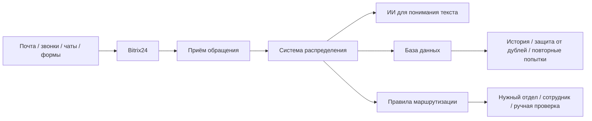
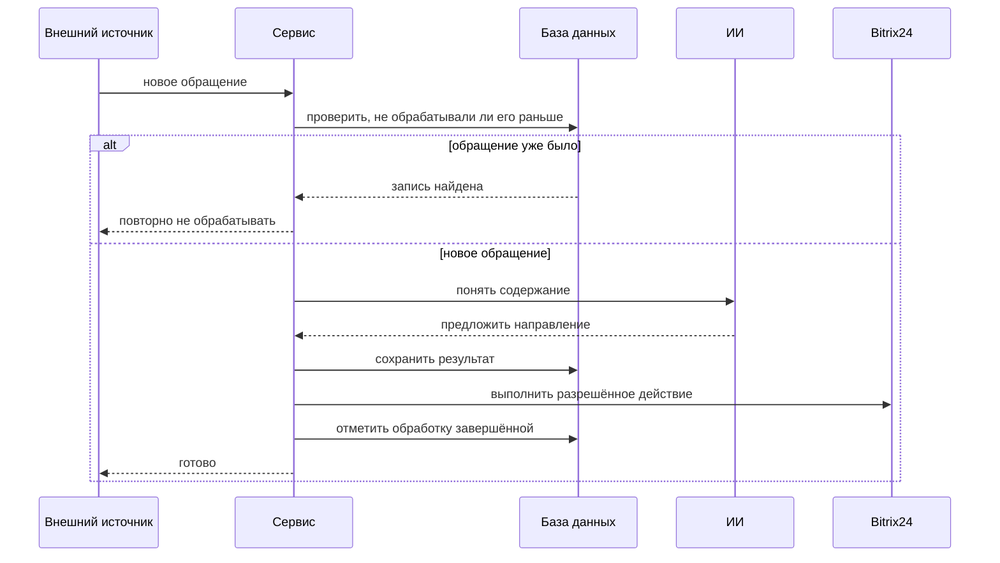
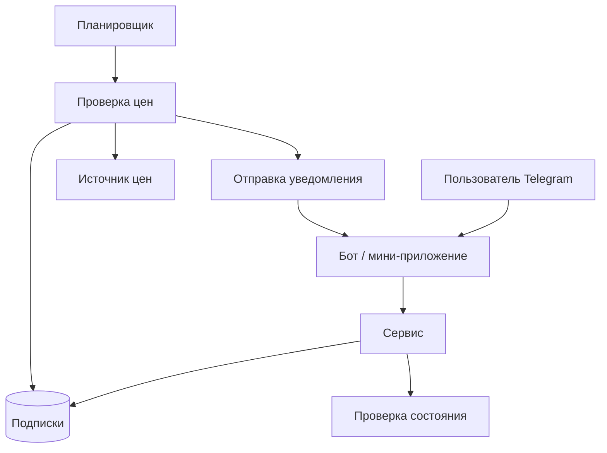
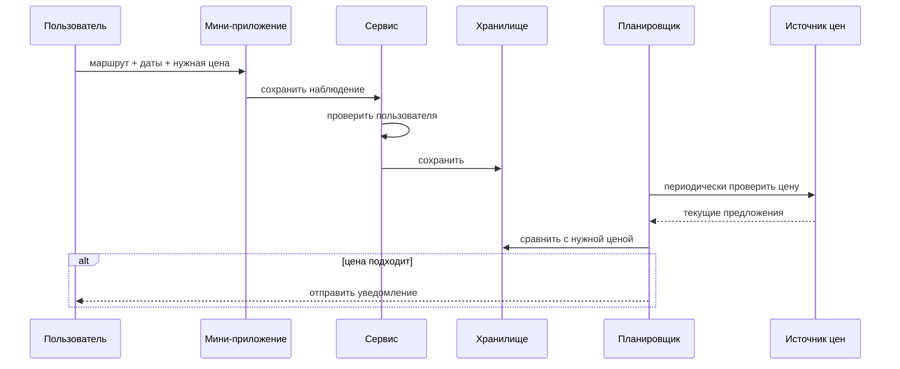
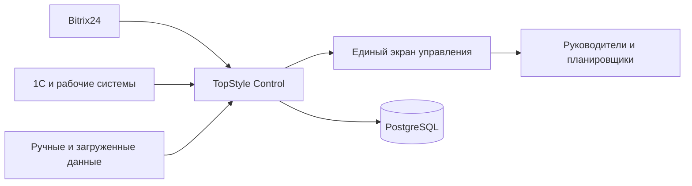

# Как устроены мои системы

Этот раздел чуть более технический, но я постарался оставить его понятным.

Здесь мне важно показать не только список технологий, а **как я думаю о системе целиком: кто с кем общается, где хранятся данные, что может сломаться и кто за что отвечает**.

## 1. Автоматизация сервиса и распределения обращений

### Общая схема

```mermaid
graph LR
    A[Почта / звонки / чаты / формы] --> B[Bitrix24]
    B --> C[Приём обращения]
    C --> D[Система распределения]
    D --> E[ИИ для понимания текста]
    D --> F[База данных]
    D --> G[Правила маршрутизации]
    G --> H[Нужный отдел / сотрудник / ручная проверка]
    F --> I[История / защита от дублей / повторные попытки]
```

### Что происходит с новым обращением

```mermaid
sequenceDiagram
    participant S as Внешний источник
    participant API as Сервис
    participant DB as База данных
    participant AI as ИИ
    participant CRM as Bitrix24

    S->>API: новое обращение
    API->>DB: проверить, не обрабатывали ли его раньше
    alt обращение уже было
        DB-->>API: запись найдена
        API-->>S: повторно не обрабатывать
    else новое обращение
        API->>AI: понять содержание
        AI-->>API: предложить направление
        API->>DB: сохранить результат
        API->>CRM: выполнить разрешённое действие
        API->>DB: отметить обработку завершённой
        API-->>S: готово
    end
```

### Что для меня здесь важно

- сначала защититься от повторного выполнения, а уже потом что-то менять во внешних системах;
- временный сбой не должен превращаться в ошибку самой заявки;
- важные состояния должны быть видны, а не прятаться внутри «магической автоматизации»;
- ответ ИИ нужно проверять так же, как любые внешние данные;
- наличие написанного кода ещё не означает, что функция уже запущена в реальной работе.

---

## 2. FlyPingAvia

### Общая схема

```mermaid
graph TB
    U[Пользователь Telegram] --> TG[Бот / мини-приложение]
    TG --> API[Сервис]
    API --> DB[(Подписки)]
    SCH[Планировщик] --> CHECK[Проверка цен]
    CHECK --> P[Источник цен]
    CHECK --> DB
    CHECK --> N[Отправка уведомления]
    N --> TG
    API --> HEALTH[Проверка состояния]
```

### Как выглядит путь пользователя

```mermaid
sequenceDiagram
    participant U as Пользователь
    participant APP as Мини-приложение
    participant API as Сервис
    participant DB as Хранилище
    participant SCH as Планировщик
    participant P as Источник цен

    U->>APP: маршрут + даты + нужная цена
    APP->>API: сохранить наблюдение
    API->>API: проверить пользователя
    API->>DB: сохранить
    SCH->>P: периодически проверить цену
    P-->>SCH: текущие предложения
    SCH->>DB: сравнить с нужной ценой
    alt цена подходит
        SCH-->>U: отправить уведомление
    end
```

### Что для меня здесь важно

- пользовательские действия и фоновые проверки разделены;
- временная ошибка источника цен не должна удалять подписку;
- настройки для разработки не должны случайно попадать в рабочую среду;
- проверка состояния сервиса — такая же часть продукта, как кнопки и экраны.

---

## 3. TopStyle Control

### Как система должна жить рядом с другими программами

```mermaid
graph LR
    CRM[Bitrix24] --> TC[TopStyle Control]
    ERP[1С и рабочие системы] --> TC
    MAN[Ручные и загруженные данные] --> TC
    TC --> WEB[Единый экран управления]
    TC --> DB[(PostgreSQL)]
    WEB --> PM[Руководители и планировщики]
```

Главная идея простая: **TopStyle Control не должен пытаться заменить вообще всё**.

CRM продолжает заниматься своей работой, 1С — своей, а новая система собирает данные, нужные для планирования и управленческого контроля.

## Несколько правил, которых я стараюсь придерживаться

1. **Сначала понять границы системы.** Что она должна делать, а что ей вообще не принадлежит.
2. **Сначала защита от дублей, потом повторные попытки.** Иначе система может дважды выполнить одно и то же действие.
3. **Важное состояние должно быть видно.** Если автоматика что-то делает, человек должен понимать, где процесс находится сейчас.
4. **ИИ — это часть системы, а не вся система.** Его ответы нужно ограничивать правилами и проверками.
5. **Сделано и реально запущено — не одно и то же.** Я стараюсь не смешивать эти понятия.
6. **Чем проще решение, тем лучше — пока простота не мешает надёжности и развитию.**

## Что хочу добавить сюда дальше

По мере развития проектов хочу показывать:

- более наглядные схемы взаимодействия систем;
- примеры важных решений и почему был выбран именно такой вариант;
- разбор возможных угроз для открытых сервисов;
- как я слежу за ошибками и состоянием работающих систем;
- сколько стоит работа внешних сервисов и искусственного интеллекта.
